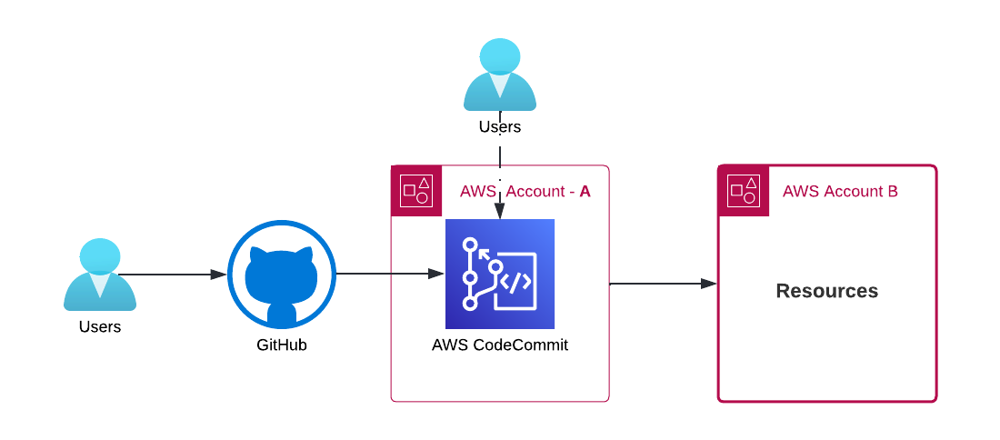

# Push github code to AWS codecommit - (CI/CD) using CDK Pipelines



## In this article

- [Purpose](#purpose)
- [Prerequisites](#prerequisites)
- [Adding the identity provider to AWS](#adding-the-identity-provider-to-aws)
- [Codecommit](#codecommit)
- [Push the code to GitHub](#push-aws-codecommit-code-to-github)
- [Integration between github and aws codecommit](#integration-between-github-and-aws-codecommit)

### Purpose

Helps users to accept code changes from both github and awscodecommit. User can commit/push in both ends i.e, github and codecommit.

Outcome, **SSOT** stays and have access to same code.

### Prerequisites

- [AWS CDK v2](https://docs.aws.amazon.com/cdk/v2/guide/getting_started.html)
- [OICD](https://docs.github.com/en/actions/deployment/security-hardening-your-deployments/configuring-openid-connect-in-amazon-web-services) in AWS

Follow this [guide](https://docs.aws.amazon.com/cdk/v2/guide/cdk_pipeline.html) will help setting up AWS CI/CD in CDK. The below steps are executed based on this doc.

## Adding the identity provider to AWS

- In AWS IAM console, click: Identity provider → Choose: OpenID Connect.

- For the provider URL: Use <https://token.actions.githubusercontent.com>
- For the "Audience": Use `sts.amazonaws.com`

- After, adding GitHub [OICD](https://docs.github.com/en/actions/deployment/security-hardening-your-deployments/configuring-openid-connect-in-amazon-web-services) provider to IAM. Execute [this](CloudFormation/github-iam.yml) CloudFormation script in Account A. Copy the IAM role from output section.

### Codecommit

1. Create a new repository in AWS codecommit (e.g: `github-codepipeline`).
2. Clone [this](https://github.com/sree7k7/github-to-aws-codepipeline) github repo.
3. [Clone](https://docs.aws.amazon.com/codecommit/latest/userguide/getting-started.html) (empty) AWS repository.
3. Copy this [github](https://github.com/sree7k7/github-to-aws-codepipeline) code and paste in AWS repository created in step 1.
    - Later, change your code accordingly.
4. Execute the following commands in terminal.

> **Note**: replace the **account-id** in `app.py`, `github_codepipe_stack.py`

```python
python3 -m venv .venv
source .venv/bin/activate
pip install -r requirements.txt
git add .
git commit -m "first commit"
git branch -M main
git push -u origin main
```

### Push aws codecommit code to GitHub

- Create a github repo (e.g: `github-codepipeline`).

```hcl
git init
git remote set-url origin git@github.com:xxxx/first_app.git
git branch -M main
git push -u origin main
```

- In github verify and clone the github repo.
- From now, you'll be using github to push the code.

### Integration between github and aws codecommit

- In github repo, create a directory .github/workflows.
- add a file: `.grade.yaml`
- In `.grade.yaml` file, change the following parameters:

```
env:
  INPUT_REPOSITORY_NAME : "<aws-codecommit-repo name>"
  AWS_REGION : <aws-region>
  AWS_CODECOMMIT_URL: <aws codecommit repo url>
  AWS_ASSUME_ROLE: <role-arn>
  AWS_ROLE_NAME: <role-name>
```

e.g:

```yaml
name: AWS codecommit
on:
  push
env:
  INPUT_REPOSITORY_NAME : "github-codepipeline"
  AWS_REGION : eu-central-1
  AWS_CODECOMMIT_URL: https://git-codecommit.eu-central-1.amazonaws.com/v1/repos/github-codepipeline
  AWS_ASSUME_ROLE: arn:aws:iam::111111111111:role/githubconnectivity-Role-xxxxxxxx
  AWS_ROLE_NAME: githubconnectivity-Role-xxxxxxxx
# permission can be added at job level or workflow level    
permissions:
      id-token: write   # This is required for requesting the JWT
      contents: read    # This is required for actions/checkout
jobs:
  awscodecommit:
    runs-on: ubuntu-latest
    steps:
      - name: Git clone the repository
        uses: actions/checkout@v3
        with:
          fetch-depth: 0
      - name: configure aws credentials
        uses: aws-actions/configure-aws-credentials@v1
        with:
          role-to-assume: ${{ env.AWS_ASSUME_ROLE }}
          role-session-name: ${{ env.AWS_ROLE_NAME }}
          aws-region: ${{ env.AWS_REGION }}
      # Sync to AWS codecommit

      - name:  Sync to AWS codecommit
        run: |
            #!/bin/sh
            set -ue
            git config --global credential.'https://git-codecommit.*.amazonaws.com'.helper '!aws codecommit credential-helper $@'
            git config --global --add safe.directory /github/workspace
            git config --global credential.UseHttpPath true

            git pull
            git remote set-url origin ${{ env.AWS_CODECOMMIT_URL }}

            git config pull.ff only
            git push origin main --force
            git push origin HEAD:main 
            git push origin main
```

In `Account B` check your resources (e.g: s3)

**links**:

- <https://docs.aws.amazon.com/cdk/v2/guide/cdk_pipeline.html>
- <https://docs.aws.amazon.com/codecommit/latest/userguide/getting-started.html>
- <https://docs.github.com/en/actions/deployment/security-hardening-your-deployments/configuring-openid-connect-in-amazon-web-services>
